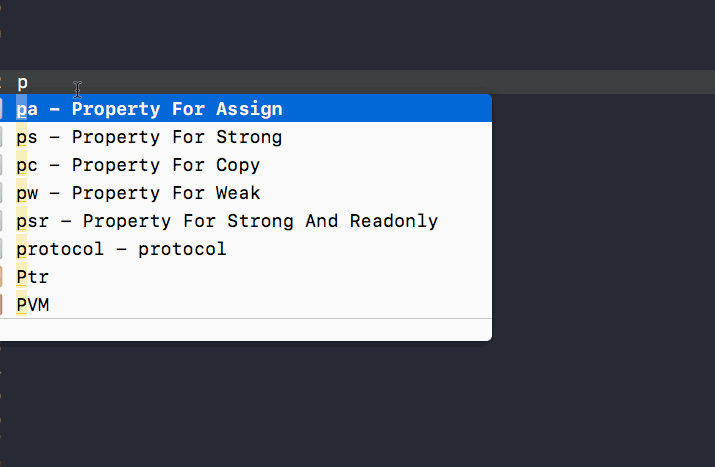

# CFCodeSnippets


将文件放入目录```~/Library/Developer/Xcode/UserData/CodeSnippets/```中
重启Xcode



<table>
<tr>
<th>简写</th>
<th>对应代码</th>
</tr>
<tr>
<td>mark1</td>
<td>#pragma mark - 1️⃣➢➢➢ <#mark#></td>
</tr>
<tr>
<td>mark!</td>
<td>//!!!!: <#注释#></td>
</tr>
<tr>
<td>blockproperty</td>
<td>@property (nonatomic,copy) <#returnType#> (^<#blockName#>)(<#parameterTypes#>);</td>
</tr>
<tr>
<td>pa</td>
<td>@property (nonatomic,assign) <#type#> <#name#></td>
</tr>

<tr>
<td>pc</td>
<td>@property (nonatomic, copy) <#type#> *<#name#></td>
</tr>

<tr>
<td>psr</td>
<td>@property (nonatomic, strong, readonly) <#type#> *<#name#></td>
</tr>

<tr>
<td>ps</td>
<td>@property (nonatomic, strong) <#type#> *<#name#></td>
</tr>

<tr>
<td>pw</td>
<td>@property (nonatomic, weak) <#type#> <#name#></td>
</tr>

<tr>
<td>sharedInstance</td>
<td>+ (instancetype)sharedInstance {<br>
    static dispatch_once_t onceToken;<br>
    static <#class name#> *instance = nil;<br>
    dispatch_once(&onceToken,^{<br>
        instance = [[super allocWithZone:NULL] init];<br>
    });<br>
    return instance;<br>
}<br>
<br>
+ (id)allocWithZone:(struct _NSZone *)zone{<br>
    return [self sharedInstance];<br>
}
</td>
</tr>

<tr>
<td>protocol</td>
<td>@protocol <#DataSource#> < NSObject > <br>
@required<br>
@end<br>
</td>
</tr>

<tr>
<td></td>
<td></td>
</tr>

<tr>
<td></td>
<td></td>
</tr>

</table>

